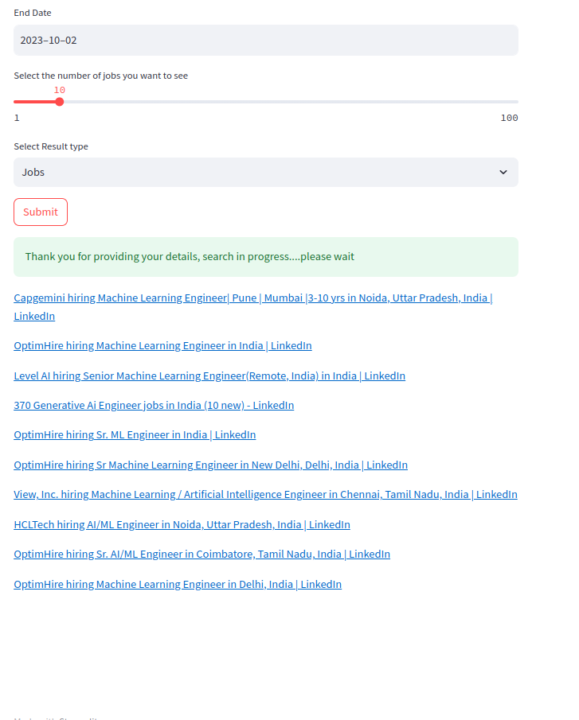

# Linkedin Job Searcher

Welcome to the Linkedin Job Searcher repository! This project is designed to make your job search on Linkedin 
more efficient by providing a tool to retrieve hiring posts & Jobs based on candidate information.

## Table of Contents

- [Installation](##installation)
- [Usage](#usage)
- [Configuration](#configuration)
- [Example](#example)
- [Ending Notes](#ending-notes)

## Installation

To get started with Linkedin Job Searcher, follow these steps:

1. Clone the repository to your local machine:

   ```bash
   git clone https://github.com/your-username/linkedin-job-searcher.git
2. Install the requirement packages:
   ```bash
   pip install -r requirements.txt

## Configuration
Set the Metaphor key in the environment variable, to get the key visit the metaphor 
[website](https://dashboard.metaphor.systems/overview) and sign in.
You will get 1000 requests free.
```bash
export METAPHOR_KEY=<KEY_VALUE>
```

## Usage

This app serves as a valuable companion for proactive job seekers eager to secure early access to enticing opportunities.
Candidates can customize their job search by specifying the desired role, availability, experience level, 
preferred location. Additionally, the app allows users to set a published date range, empowering 
them to explore the latest job postings or delve into older opportunities. By tailoring their preferences, candidates 
can stay ahead of the curve in the competitive job market.

In order to start the application after configuration, run below command - 
```bash
streamlit run app.py
```

## Example

```bash
streamlit run app.py
```
App:


Output:



## Ending-notes

The accuracy in the app is still a issue which needs to be dealt with.
Future enhancements,
1. Evaluation Framework
2. Linkedin Hiring Company profiles
3. Linkedin hiring people profiles